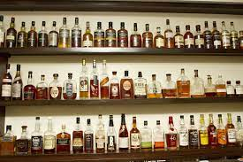

```{r echo=FALSE, out.width="100%"}

```

```{r setup, include=FALSE}
knitr::opts_chunk$set(warning = FALSE, message = FALSE)

library(dplyr)
library(GGally)
library(factoextra)
library(FactoMineR)
library(animation)
library(tidyr)
library(ggiraphExtra)
library(plotly)
```

# **1. DATA INTRODUCTION**  
  
As data scientists of a whiskey shop are asked to make a product recommendation for whiskey based on each customer's taste preferences!  
  
Purpose: to form a group of whiskeys that have a distinctive taste characteristic in each cluster  
  
## **1.1. Data Preparation**  
Read the data. 
```{r}
(whiskey <- read.csv("whiskies.txt"))
glimpse(whiskey)
```
The data used are Malt Whiskey distillation data from 86 distilleries, obtained from the research of Dr. Wisehart (University of St. Andrews). Each whiskey is scored 0-4 out of 12 flavor categories based on organoleptic tests:  
- `Body`: level of strength of taste (light/heavy)  
- `Sweetness`: level of sweetness  
- `Smoky`: level of smoke taste  
- `Medicinal`: level of bitter taste (medicine)  
- `Tobacco`: tobacco taste level  
- `Honey`: level of honey taste  
- `Spicy`: spicy level  
- `Winey`: wine taste level  
- `Nutty`: nutty flavor level  
- `Malty`: wheat flavor level  
- `Fruity`: fruit flavor level  
- `Floral`: floral flavor level    
  
## **1.2. Data Preprocessing**  
Check missing value
```{r}
anyNA(whiskey)
```
Data Cleansing
```{r}
# assign value from Distillery column to row name
rownames(whiskey) <- whiskey$Distillery

# discard unused columns
whiskey <- whiskey %>% 
  select(-c(RowID, Distillery, Postcode, Latitude, Longitude))

head(whiskey)
```
  
# **2. DATA EXPLORATORY**  
  
Check the scale between variables
```{r}
summary(whiskey)
```
since the data types are quite the same, so there is no need to do scaling.  
  
Here we will explore the data distribution of each numeric variable using density plot and the correlation between each variable using scatterplot which were provided within `ggpairs` function from GGally package.
```{r}
ggpairs(whiskey[,c(1:7)], showStrips = F) + 
  theme(axis.text = element_text(colour = "black", size = 11),
        strip.background = element_rect(fill = "#d63d2d"),
        strip.text = element_text(colour = "white", size = 12,
                                  face = "bold"))
```
It can be seen that there is a strong correlation between some variables from the data, including `Body`-`Smoky`, `Smoky`-`Medicinal.` This result indicates that this dataset has multicollinearity and might not be suitable for various classification algorithms (which have non-multicollinearity as their assumption).  
  
**Principal Component Analysis** can be performed for this data to produce non-multicollinearity data, while also reducing the dimension of the data and retaining as much as information possible. The result of this analysis can be utilized further for classification purpose with lower computation.
  
# **3. CLUSTERING**  
  
Obtaining K optimum.
```{r}
fviz_nbclust(x = whiskey,
             FUNcluster = kmeans,
             method = "wss")
```
From the plots, we can see that **5 is the optimum number of K**. After k=5, increasing the number of K does not result in a considerable decrease of the total within sum of squares (strong internal cohesion) nor a considerable increase of between sum of square and between/total sum of squares ratio (maximum external separation).
```{r}
# k-means clustering
set.seed(50)
(whiskey_k <- kmeans(x = whiskey,
                    centers = 5))
```
- The number of repetitions (iterations) of the k-means algorithm until a stable cluster is produced.
```{r}
whiskey_k$iter
```
The goodness of clustering results can be seen from 3 values:  
  
- Within Sum of Squares (`$withinss`): the sum of the squared distances from each observation to the centroid of each cluster.  
- Between Sum of Squares (`$betweenss`): the sum of the weighted squared distances from each centroid to the global average. The weight is based on the number of observations in the cluster.  
- Total Sum of Squares (`$totss`): the sum of the squared distances from each observation to the global average.  
  
- Chek WSS values.
```{r}
whiskey_k$withinss
whiskey_k$tot.withinss
```
- Chek BSS/TSS ratio.
```{r}
whiskey_k$betweenss
whiskey_k$totss
```
Nevertheless, **new cluster can be made using this dataset and these new clusters also have different characteristics owned by each cluster**. Visualization and profiling of cluster results can give us additional information about each clusters which can be useful for us from a business perspective.  
  
To visualize the result of K-means clustering we can use various functions from factoextra package or by combining it with PCA. This time will use factoextra package (I will combine the result with PCA in a later section).  
```{r}
# data preparation for visualization & profiling
whiskey$cluster <- as.factor(whiskey_k$cluster)
whiskey
```

```{r}
# clustering visualization
fviz_cluster(object = whiskey_k, 
             data = whiskey %>% select(-cluster))
```

```{r}
# cluster profiling
(whiskey_centroid <- whiskey %>% 
  group_by(cluster) %>% 
  summarise_all(mean))
```
Cluster Profiling:  
  
* `Cluster 1`:  
   - Highest in the taste of honey, winey, nutty, malty, friuty.  
   - Lowest medicinal and Tobacco  
   - Label : nano-nano/juicy sweet whiskey  
  
* `Cluster 2`:  
   - Highest Body, smoky, medicinal, tobacco  
   - Lowest sweetness, honey, malty, floral  
   - Label : whiskey bad boys, tongkongan gentlemen -> bitter whiskey  
  
* `Clusters 3`:  
   - The tallest floral  
   - Lowest body, smoky, tobacco  
   - Label : whiskey flavored flowers / flower garden -> whiskey paradise  
  
* `Clusters 4`:  
   - The highest is none / no one dominates  
   - Lowest fruity taste  
   - Label: medicore flavored whiskey  
  
* `Clusters 5`:  
   - Highest in sweetness, spicy taste  
   - Lowest nutty  
   - Label: bitchy sweet whiskey  
  
```{r}
# Additional Profiiling
ggRadar(data=whiskey, 
        aes(colour=cluster), 
        interactive=TRUE)
```

# **4. PRINCIPAL COMPONENT ANALYSIS**  
  
PCA using FactoMineR
```{r}
quanti <- whiskey %>% 
  select_if(is.numeric) %>% 
  colnames()

# numeric column index
quantivar <- which(colnames(whiskey) %in% quanti)

# numeric column name (qualitative)
quali <- whiskey %>% 
  select_if(is.factor) %>% 
  colnames()

# categoric column name
qualivar <- which(colnames(whiskey) %in% quali)

(whiskey_pca <- PCA(X = whiskey, #data
                  scale.unit = FALSE,
                  quali.sup = qualivar,
                  ncp = 13,
                  graph = FALSE))
summary(whiskey_pca)
```
```{r}
whiskey_pca$eig
```
```{r}
head(whiskey_pca$ind$coord)
```
Through PCA, We can retain some informative principal components (high in cumulative variance) from Kernels dataset to perform dimensionality reduction. By doing this, I can **reduce the dimension of the dataset while also retaining as much information as possible**.  
  
In this study, I want to retain at least 90% of the information from our data. From the PCA summary (whiskey_pca$eig), I picked PC1-PC8 from a total of 12 PC. By doing this, I was able to reduce the dimension from my original data while retaining 90% of the information from the data.  
  
We can extract the values of PC1-PC8 from all of the observations and put it into a new data frame. This data frame can later be analyzed using supervised learning classification technique or other purposes.
```{r}
# making a new data frame from PCA result
(whiskey_var90 <- as.data.frame(whiskey_pca$ind$coord[ , 1:8]))
```

# **5. COMBINING CLUSTERING AND PCA**   
  
From the previous section, we have discussed that PCA can be combined with clustering to obtain better visualization of our clustering result, or simply to understand the pattern in our dataset. This can be done by using a biplot, a common plot in PCA to visualize high dimensional data using PC1 and PC2 as the axes.

We can use `plot.PCA` to visualize a `PCA object` with added arguments for customization.
```{r}
plot.PCA(
  x = whiskey_pca,
  choix = "ind",
  habillage = T,
  label = "quali",
  col.ind = whiskey$Type,
  title = "Colored by Type"
)

plot.PCA(
  x = whiskey_pca,
  choix = "ind",
  habillage = T,
  label = "quali",
  col.ind = whiskey$cluster,
  title = "Colored by Cluster"
)
```
The plots above are examples of **individual factor map** of a biplot. The points in the plot resemble observations and colored by their Type (original Kernel type) and Cluster (Kernel by clustering result). Dim1 and Dim2 are PC1 and PC2 respectively, with their own share (percentage) of information from the total information of the dataset.  
  
From the biplot, we can clearly see in the **Colored by Type** plot, some observations from different clusters were located really close with one another and an overlapping view of clusters can be seen. Meanwhile, in the **Colored by Cluster** plot, we can see that the clusters separate nicely without overlapping view of clusters.  
  
This visualization supports the assumption made during clustering result analysis, which was, *“..there might be Kernels with similar geometrical properties which originate from different type/species. This indicates that the geometrical properties of Kernels alone are not sufficient enough to obtain a clustering that resembles Kernels types.”*  
  
After this, I will focus on the interpretation of biplots which observations were colored based on clusters that we have made before.  
   
# **6. SUMMARY**  
  
From the unsupervised learning analysis above, we can summarize that:  
  
  1. K-means clustering can be done using this dataset, although, the clusters did not resemble Kernels types. Geometrical properties of Kernels alone are not sufficient enough to obtain a clustering that resembles Kernels types. Additional properties such as genetic and metabolites properties of each Kernel might be needed to obtain such clustering.  
  
  2. Dimensionality reduction can be performed using this dataset. To perform dimensionality reduction, we can pick PCs from a total of 12 PC according to the total information we want to retain. In this article, I used 8 PCs to reduce the dimension from my original data while retaining 90% of the information from the data.  
  
  3. The improved data set obtained from unsupervised learning (eg.PCA) can be utilized further for supervised learning (classification) or for better data visualization (high dimensional data) with various insights.  